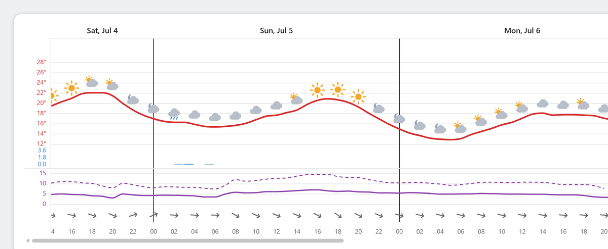
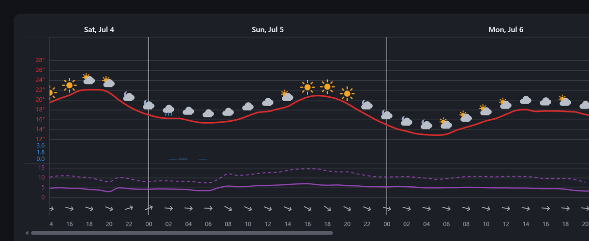

# yr-meteogram-ts

A small, dependency-free TypeScript project that draws a scrollable, multi-day
weather **meteogram** — temperature line, precipitation bars, wind speed +
gusts, weather icons, and wind-direction arrows — in the style of yr.no's
forecast graph, using MET Norway's free Locationforecast API. No charting
library; the chart is a hand-built SVG.

It ships in **two forms from one codebase**:

- **Home Assistant card** — a HACS-installable Lovelace custom card (most people want this).
- **Standalone web app** — a Vite dev/demo app (see [`DEVELOPMENT.md`](DEVELOPMENT.md)).





*Light and dark themes. The Home Assistant card follows your dashboard theme;
the web app follows your OS theme (with a manual toggle).*

## Home Assistant card

Install it as a custom dashboard card via **HACS**:

1. HACS → ⋮ → **Custom repositories** → add
   `https://github.com/ryssel/yr-meteogram-ts`, category **Dashboard**.
2. Find **Meteogram Card** in the list → **Download**.
3. Set up the MET proxy (below), then add the card to your dashboard.

> **⚠️ You must set up a MET proxy first.** MET Norway requires a descriptive
> `User-Agent` header, and browsers can't set one from JavaScript — so the card
> **cannot call `api.met.no` directly**. You point it at a small proxy (an NGINX
> Proxy Manager location block, or a Cloudflare Worker) that adds the header
> server-side. Without it the card gets a `403`.

Minimal card config once the proxy is in place:

```yaml
type: custom:meteogram-card
proxy_url: /met        # relative path = same-origin; avoids CORS/mixed-content
# latitude/longitude default to your Home Assistant home location if omitted
# days: 3              # optional — leave it out to get the full forecast (see below)
```

💡 **Out of the box you get MET's full ~10-day forecast** in one scrollable
chart — hourly detail for the first ~2 days, then a neatly compressed 6-hourly
long-range tail so the whole ten days stays scannable at a glance. No config
needed for the range; set `days` only if you *want* a shorter window.

**Full install, proxy setup (NGINX + Cloudflare), configuration, and
troubleshooting are in [`ha-card/README.md`](ha-card/README.md).** The card
follows your Home Assistant theme and works well on mobile via the Companion app.

## Web app & development

There's also a standalone Vite web app — the original form of this project. To
run or develop it, and for an overview of how the chart is built and how to
build/release the card, see **[`DEVELOPMENT.md`](DEVELOPMENT.md)**.

## Data attribution

Forecast data from [MET Norway](https://api.met.no/), licensed
[CC BY 4.0](https://creativecommons.org/licenses/by/4.0/). Attribution to MET
Norway is required when using this data.
