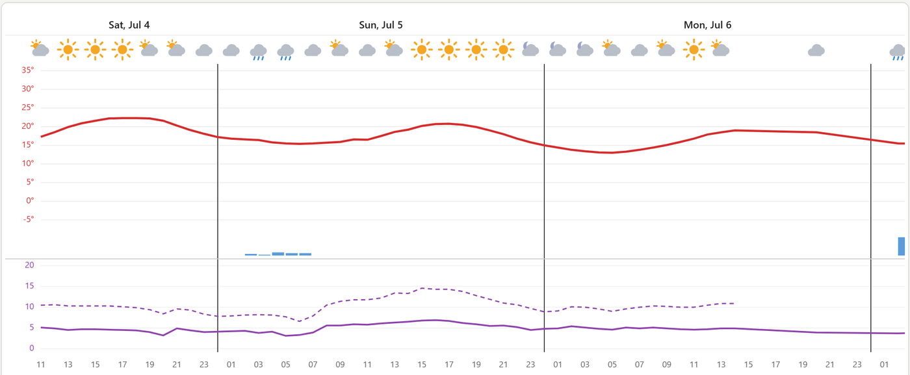

# Meteogram Card for Home Assistant

A custom Home Assistant Lovelace card that displays a scrollable, multi-day
weather meteogram (temperature, precipitation, wind speed + gusts, weather
icons) using MET Norway's free Locationforecast API — in the style of yr.no's
forecast graph.



## Features

- 📊 Scrollable chart: temperature line, precipitation bars, wind speed + gusts
- 🌍 Free MET Norway weather data (CC BY 4.0)
- 🕐 Hourly resolution across MET's full hourly window (~2 days)
- 📱 Mobile-friendly, respects Home Assistant themes
- 🎨 Original hand-drawn weather icons keyed off MET's full `symbol_code`

## How the data flows (read this first)

MET Norway **requires a descriptive `User-Agent` header** identifying your app
and a way to contact you, or it returns `403`. Browsers cannot set a custom
`User-Agent` from JavaScript, so the card **cannot call `api.met.no` directly**.
You must point the card at a small **proxy** that adds the header server-side.

This card is built to sit behind a proxy path on the same host that serves your
Home Assistant frontend (so it's same-origin — no CORS, no mixed-content). If
you already run the **NGINX Proxy Manager** add-on, that's a one-block change
(see below).

## Installation (HACS)

### 1. Add the repository to HACS

1. HACS → ⋮ (top right) → **Custom repositories**
2. Repository: `https://github.com/ryssel/yr-meteogram-ts`
3. Category: **Dashboard**
4. Add, then find **Meteogram Card** in the list → **Download**

HACS installs the card and (usually) registers the Lovelace resource
automatically. If it doesn't, add the resource manually under
Settings → Dashboards → ⋮ → Resources:
`/hacsfiles/yr-meteogram-ts/meteogram-card.js` (type: JavaScript Module).

### 2. Set up the MET proxy

#### Recommended: NGINX Proxy Manager (you likely already run this)

In NGINX Proxy Manager, edit the **proxy host** that serves your Home Assistant
frontend → **Advanced** tab → add this location block:

```nginx
location /met/ {
    proxy_pass https://api.met.no/;
    proxy_set_header Host api.met.no;
    proxy_set_header User-Agent "yr-meteogram-ha (https://github.com/ryssel/yr-meteogram-ts)";
    proxy_ssl_server_name on;          # required: SNI, or the TLS handshake to api.met.no fails
    proxy_ssl_name api.met.no;
    add_header Access-Control-Allow-Origin * always;
}
```

Notes:
- **Paste the whole block, including the closing `}`.** A missing brace makes
  the entire nginx config invalid, so NGINX Proxy Manager refuses to reload and
  *all* sites on that host go down until you fix or remove it.
- Because this lives on the **same host** as your HA frontend, the card fetches
  it same-origin — no CORS and no mixed-content issues.
- `proxy_ssl_server_name on` is not optional: `api.met.no` is behind a CDN that
  needs SNI, and the upstream TLS handshake fails without it.
- The `/met/` prefix is more specific than the default `/` location that proxies
  to Home Assistant, so it takes precedence and doesn't disturb the HA proxy.
- MET's Terms ask you to identify yourself and honor caching. The `User-Agent`
  above uses the repo URL as the contact. For a single household polling every
  few minutes you're well within limits; if you want to be extra polite you can
  add NGINX `proxy_cache` for this location.

Your `proxy_url` is then just the **relative path** `/met`. Because the card
fetches it same-origin (whatever URL you're viewing HA on), this avoids CORS and
mixed-content problems entirely — set `proxy_url: /met`. (An absolute URL like
`https://ha.yourdomain.com/met` also works, but only from that exact origin and
is prone to CORS/mixed-content errors — prefer the relative form.)

**Verify it before adding the card.** Open this in a browser (adjust the
domain/coordinates) — you should get MET JSON, not a `403` or an error:

```
https://ha.yourdomain.com/met/weatherapi/locationforecast/2.0/complete?lat=59.9139&lon=10.7522
```

#### Alternative: Cloudflare Worker

If you don't run a reverse proxy, a free Cloudflare Worker also works (it's an
external service you sign up for and deploy once):

```js
export default {
  async fetch(request) {
    const url = new URL(request.url);
    const lat = url.searchParams.get("lat"), lon = url.searchParams.get("lon");
    if (!lat || !lon) return new Response("lat & lon required", { status: 400 });
    const upstream = `https://api.met.no/weatherapi/locationforecast/2.0/complete?lat=${lat}&lon=${lon}`;
    const r = await fetch(upstream, {
      headers: { "User-Agent": "yr-meteogram-ha (https://github.com/ryssel/yr-meteogram-ts)" },
      cf: { cacheTtl: 900, cacheEverything: true },
    });
    return new Response(r.body, {
      status: r.status,
      headers: {
        "content-type": "application/json",
        "access-control-allow-origin": "*",
        "cache-control": "public, max-age=900",
      },
    });
  },
};
```

Note: this Worker reads `lat`/`lon` from the query string and ignores the path,
so it works with the card as-is — set `proxy_url` to your Worker URL (e.g.
`https://something.workers.dev`). The card appends the MET path and coordinates;
the Worker only cares about the coordinates.

### 3. Add the card to your dashboard

```yaml
type: custom:meteogram-card
proxy_url: /met   # relative path = same-origin; avoids CORS/mixed-content
# latitude/longitude default to your Home Assistant location if omitted:
# latitude: 59.9139
# longitude: 10.7522
# days: 3   # optional cap; omit to show MET's full hourly window (~2 days)
```

## Configuration

| Option | Type | Default | Description |
|--------|------|---------|-------------|
| `proxy_url` | string | — | **Required.** Base path of your MET proxy — use the relative `/met` (same-origin, recommended). The card appends `/weatherapi/locationforecast/2.0/complete?lat=…&lon=…`. An absolute `https://…/met` also works but is CORS/mixed-content prone. |
| `latitude` | number | HA config latitude | Forecast location latitude |
| `longitude` | number | HA config longitude | Forecast location longitude |
| `days` | integer | full hourly window | Optional cap (1–14) on days shown. Omit to show all hourly points MET provides (~2 days). |

## What it renders

- **Top pane**: temperature line + precipitation bars
- **Bottom pane**: wind speed (solid) and gusts (dashed)
- **Day separators**: vertical lines at midnight
- **Icon row**: weather icons from MET's `symbol_code`

The card shows **hourly** points across MET's full hourly window (currently
~2 days / ~50 hours); MET's coarser 6-hourly data beyond that is intentionally
not shown.

## Troubleshooting

**"Configuration error: proxy_url is required"** — add `proxy_url` to the card
config (see above).

**"Error loading forecast: Failed to fetch"** — a browser-level failure (CORS,
mixed-content, TLS, or unreachable host), not an HTTP error. Fix: set
`proxy_url: /met` (relative → same-origin) and make sure you're accessing HA
**through the NGINX proxy** that has the `/met/` block, not a bare
`http://homeassistant.local:8123`. Check the browser console (F12) for the exact
reason.

**"Error loading forecast: API error: 403"** — the proxy isn't adding the MET
`User-Agent`. Check your NGINX location block / Worker.

**"Error loading forecast: …" with a TLS/SSL error** — you're missing
`proxy_ssl_server_name on;` in the NGINX block.

**Blank card / no lines** — hard-reload the dashboard (Ctrl+Shift+R) and check
the browser console (F12). Confirm the Lovelace resource points at
`meteogram-card.js`.

## Data attribution

Forecast data from [MET Norway](https://api.met.no/), licensed
[CC BY 4.0](https://creativecommons.org/licenses/by/4.0/). Attribution to MET
Norway is required when using this data.

## Development

```bash
npm install
npm run build:card          # builds ha-card/dist/meteogram-card.js
npm run build:card:watch    # rebuild on change
```

Releases are published by tagging (`git tag vX.Y.Z && git push origin vX.Y.Z`);
a GitHub Action builds the card and attaches `meteogram-card.js` to the release,
which is what HACS downloads.

## License

Provided under the same license as the main yr-meteogram project.
